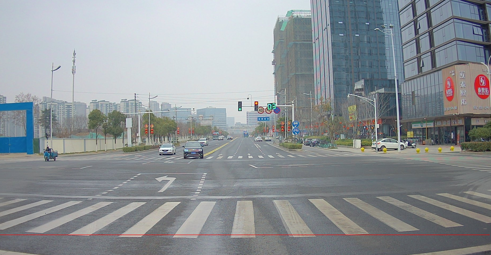
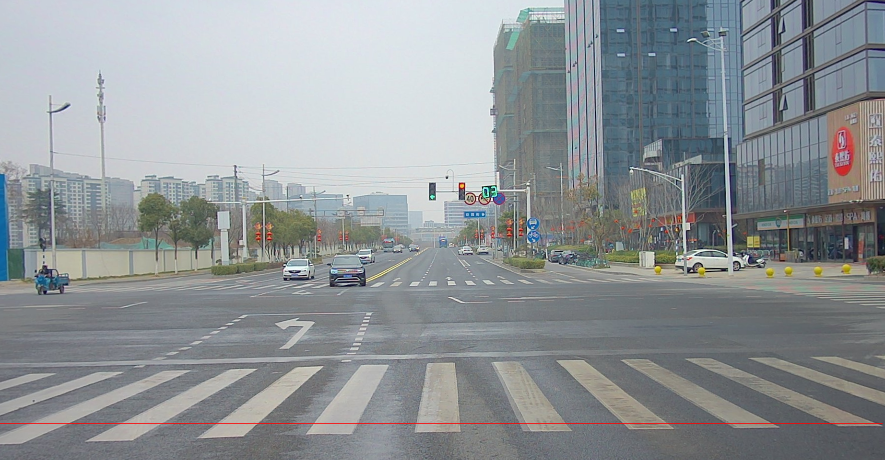
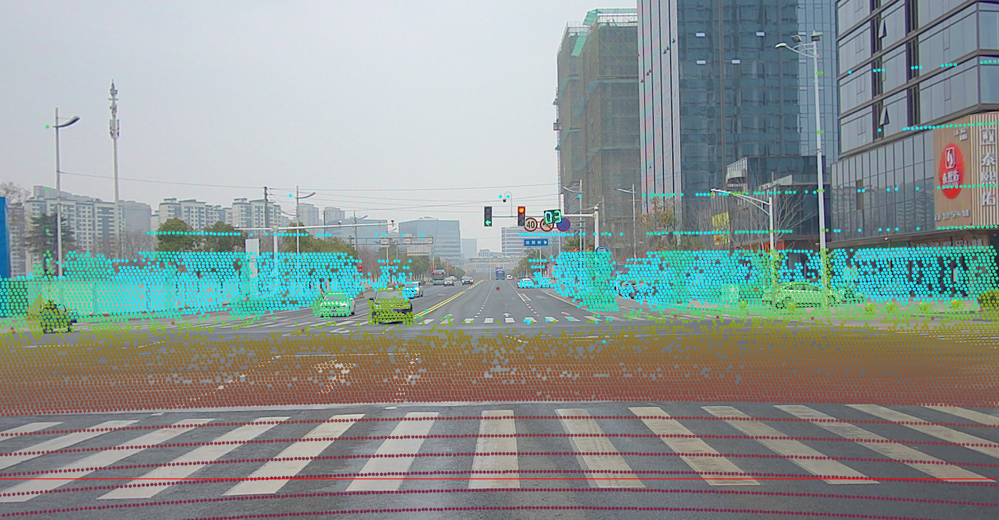
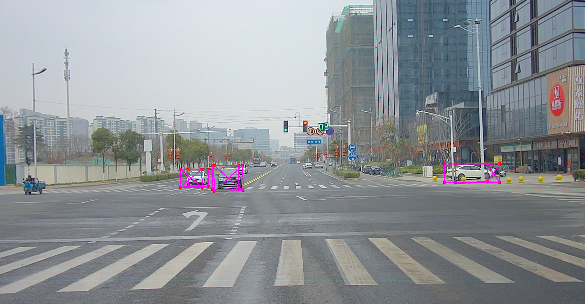

# Lidar_camera_sync

The scripts to process Lidar/camera sync & projection and etc.

## Major features
* Support camera-image distortion.
* Support points projection from lidar to camera-image.
* Support 3d-boxes projection from lidar to camera-image.

## Installation

requirements
```
    python3.6
    numpy
    open3d
    pickle
    matplotlib
    opencv-python
```

## Usage

Please refer to demo.py.

Preparation:
```
    1. You must have a camera-lidar conversion matrix 
    2. If need project 3d-box, please prepare 3d-box numpy-txt
```

Open terminal, and run:
```
    python demo.py
```
Then you will see the projection result as below:

original:


distortion:


points on image:


boxes on image:



