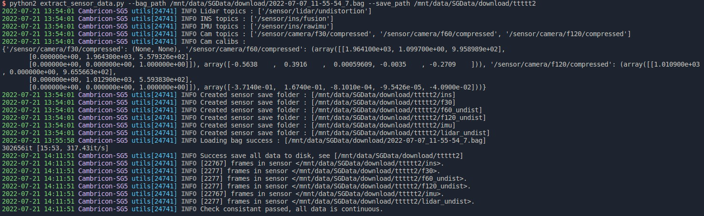
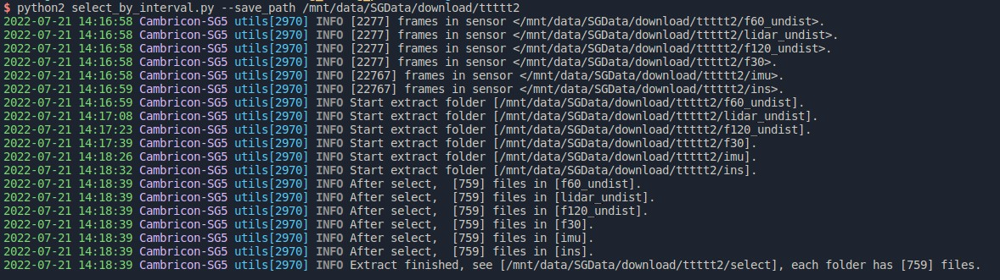
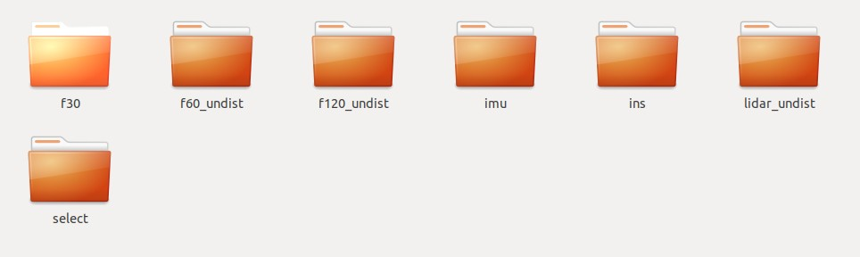

# SG_rosbag_process

* 脚本功能: 对 SG5 采集的 rosbag 数据进行拆包存储，时间戳检查，以及抽帧（以供送标）


## Dependency
* python2
* rospy
* rosbag
* python-pcl
* tqdm
* coloredlogs (推荐)


## Usage

共两个步骤，在终端中，使用 python 分别运行: 

```
步骤一: 
    python extract_sensor_data.py \
    --bag_path ./2022-06-22_11-17-32_4.bag \
    --save_path ./2022-06-22_11-17-32_4

步骤二：
    python select_by_interval.py \
    --save_path ./2022-06-22_11-17-32_4 \
    --interval 3
```

## Args

* --bag_path  : 指定输入的 rosbag 路径
* --save_path : 指定抽帧数据保存的目录, 两个步骤中的该参数应相同
* --interval  : 指定抽帧的间隔, 缺省值为 3

```
配置文件的说明:
    cfg.py 中描述了需要抽帧的传感器数据，
    修改 default_topic_sensor_name_dict 可以控制保存哪些 sensor data 及保存的目录名称
    修改 default_calibration_files 可以指定系统组给出的相机标定参数文件（必须是 yaml 格式，默认为 MKZ-A3QV50 文件夹下的几个yaml文件）
```

## Output
步骤一的输出：

步骤二的输出：



在 save_path 可以看到如下目录结构:


其中, select 目录中存放的是最终抽帧后的数据。

* 务必注意 output 中的告警信息，如出现帧时间不连续、找不到时间戳数据，必须人为校正或删除该包数据！
